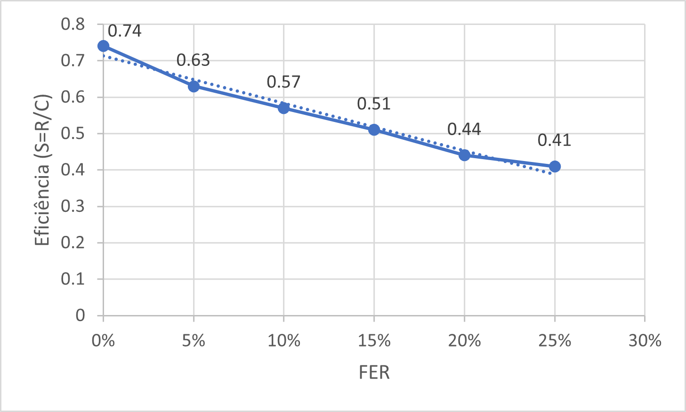
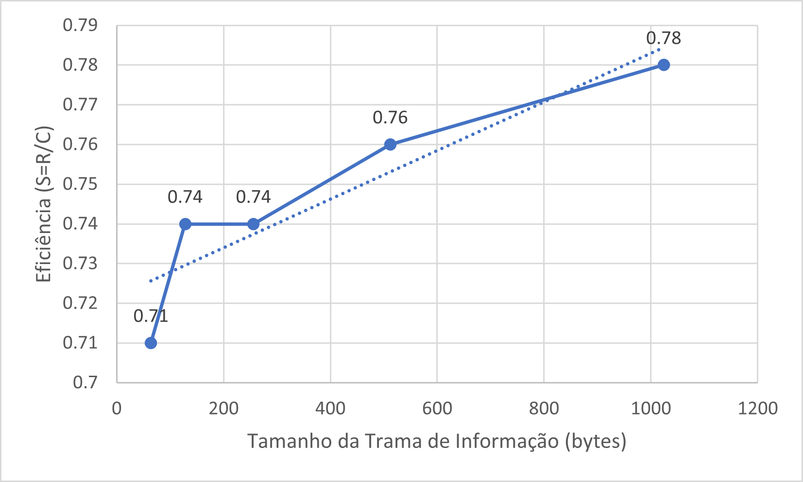
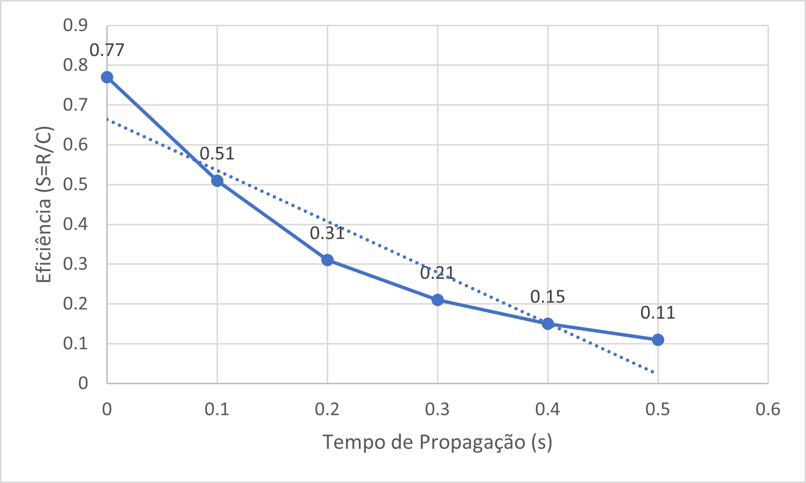

## Sumário

Este trabalho laboratorial foi desenvolvido no âmbito da Unidade Curricular de Redes de Computadores e teve como objetivo aplicar na prática os conceitos teóricos lecionados na mesma, mais precisamente implementar uma aplicação e protocolo que permitissem a transmissão de ficheiros através de uma porta série assíncrona, protegida de possíveis erros de transmissão.

Os objetivos do trabalho, estabelecidos no guião, foram cumpridos com sucesso. Foi desenvolvida uma aplicação funcional, capaz de lidar com qualquer tipo de ficheiro e transmiti-lo entre dois computadores, sem perda de dados.

## Introdução

O trabalho teve como objetivo desenvolver uma aplicação, suportada por um protocolo de dados, que, com recurso à comunicação por tramas de informação e através de uma porta série, tem a capacidade de funcionar como um mecanismo de transferência de ficheiros entre computadores, resiliente à ocorrência de falhas de conexão.

Este relatório serve como complemento ao projeto, documentando o mesmo, assim como uma análise estatística da sua execução. O mesmo está divido nas seguintes secções:

- [**Arquitetura**](#arquitetura): Identificação dos blocos funcionais e interfaces.
- [**Estrutura do Código**](#estrutura-do-código): Descrição das APIs, principais estruturas de dados, principais funções e a sua relação com a arquitetura.
- [**Casos de Uso Principais**](#casos-de-uso-principais): Identificação dos casos de uso e descrição da corrente de chamadas de funções.
- [**Protocolo de Ligação Lógica**](#protocolo-de-ligação-lógica): Identificação dos principais aspetos funcionais da ligação lógica e descrição da estratégia de implementação destes aspetos.
- [**Protocolo de Aplicação**](#protocolo-de-aplicação): Identificação dos principais aspetos funcionais da camada de aplicação e descrição da estratégia de implementação destes aspetos.
- [**Validação**](#validação): Descrição dos testes efetuados com apresentação quantificada dos resultados.
- [**Eficiência do protocolo de ligação de dados**](#eficiência-do-protocolo-de-ligação-de-dados): Caraterização estatística da eficiência do protocolo, efetuada recorrendo a medidas sobre o código desenvolvido.
- [**Conclusões**](#conclusões): Síntese da informação apresentada nas secções anteriores e reflexão sobre os objetivos de aprendizagem alcançados.

## Arquitetura

O protocolo de comunicação, implementado de acordo com o guião fornecido, assenta-se em duas camadas independentes: a camada de ligação (*link layer*) e a camada de aplicação (*application layer*).

A camada de ligação (definida nos ficheiros `link_layer.c` e `link_layer.h`) especializa-se no estabelecimento da conexão, envio e receção de tramas de informação, e encerramento da conexão. É esta camada que verifica a validade da informação e resolve a ocorrência de erros de comunicação. As funções necessárias para estas tarefas são fornecidas por esta camada.

A camada de aplicação (definida nos ficheiros `app.c` e `app.h`) utiliza o serviço da camada de ligação e é responsável por tratar os dados a ser enviados/recebidos, gerando pacotes de controlo e pacotes de dados numerados.

## Estrutura do Código

A estrutura do código relaciona-se diretamente com a arquitetura definida. Existem dois executáveis resultantes, um responsável pela transmissão (*writer*) e outro pela receção (*reader*) de dados. Estes utilizam as camadas definidas para cumprir a sua função.

### Camada de ligação

- `llopen` - Configura a porta série e inicia a conexão de acordo com a *flag* que indica se está a ser utilizada pelo *writer* ou pelo *reader*.
- `llwrite` - É utilizada pelo *writer* para escrever tramas de informação.
- `llread` - É utilizada pelo *reader* para ler tramas de informação.
- `llclose` - Repõe as configurações da porta série e termina a conexão de acordo com a *flag* que indica se está a ser utilizada pelo *writer* ou pelo *reader*.
- `timeout_write` - Função auxiliar, utilizada para escrever uma trama e retransmitir a mesma um determinado número de vezes se não obter uma resposta dentro de um determinado intervalo de tempo.
- `nc_read` - Função auxiliar, utilizada para ler uma trama e responder adequadamente.

São ainda utilizadas outras funções para a geração e validação de tramas, assim como operações de *byte stuffing*/*destuffing*.

### Camada de aplicação

- `make_data_package` - Gera um pacote de dados com as configurações necessárias
- `read_data_package` - Lê e interpreta um pacote de dados
- `make_control_package` - Gera um pacote de controlo com as configurações necessárias
- `read_control_package` - Lê e interpreta um pacote de controlo

## Casos de Uso Principais

Os programas desenvolvidos têm como principal caso de uso a transferência de ficheiros entre dois computadores, através de uma porta série, sendo um computador responsável por ser o transmissor e outro responsável por ser o recetor.

### Compilação e execução

Para utilizar os programas desenvolvidos, é necessário compilar os mesmos (através do comando `make`) e executá-los com os respetivos argumentos. De seguida encontram-se as instruções de execução dos mesmos:

Considera-se `wnc` como o executável resultante da compilação de `writenoncanonical.c` e `rnc` o executável resultante da compilação de `readnoncanonical.c`.

---

Instruções de execução do `wnc`: 

```  
./wnc serial_port file_path [-v]
```

- **serial_port**: obrigatório, indica o nº da porta de série
- **file_path**: obrigatório, indica o caminho do ficheiro a enviar
- **-v**: opcional, ativa o modo verboso  

Exemplos:

- `./wnc /dev/ttyS1 pinguim.gif`
- `./wnc /dev/ttyS0 images/picture.gif -v`

---

Instruções de execução do `rnc`:  

``` 
./rnc serial_port [file_path] [-v]
```

- **serial-port**: obrigatório, indica o nº da porta de série
- **file_path**: opcional, indica o nome do ficheiro de destino (não estando definido, o ficheiro é guardado com o seu nome original)
- **-v**: opcional, ativa o modo verboso 

Exemplos:

- `./rnc /dev/ttyS1`
- `./rnc /dev/ttyS1 -v`
- `./rnc /dev/ttyS0 picture.gif -v`

### Sequências de chamada de funções

A transmissão dos dados segue a seguinte sequência:

1. O recetor e transmissor são iniciados numa porta série, definindo no transmissor o ficheiro a ser enviado.
2. É configurada a porta série e iniciada a conexão entre os dois computadores, com recurso à função `llopen`.
3. Estando a conexão iniciada, o transmissor envia um pacote de controlo, utilizando a `make_control_package` e `llwrite`, o qual é recebido pelo recetor através da `llread` e `read_control_package`.
4. O transmissor divide o ficheiro em tamanhos preestabelecidos e envia os vários pacotes de dados, com recurso à `make_data_package` e `llwrite`, os quais são recebidos pelo recetor pela `llread` e `read_data_package`.
5. Terminando a transferência de dados, é enviado novamente um pacote de controlo, que indica o fim da transferência.
6. Finalmente, a conexão é terminada e as configurações iniciais da porta série são repostas, com recurso à função `llclose`. As estatísticas da transferência são impressas.

## Protocolo de Ligação Lógica

O Protocolo de Ligação Lógica foi implementado nos ficheiros `link_layer.h` e `link_layer.c`. O objetivo deste protocolo é fornecer um serviço de comunicação de dados fiável entre dois sistemas ligados por um meio de transmissão, neste caso, um cabo de série. A transmissão é organizada em tramas que podem ser de dois tipos: 

- **Tramas de Supervisão** para comandos e respostas, com a estrutura: |F|A|C|BCC1|F| 

- **Tramas de Informação** que servem de *wrap* para os dados a serem transportados, com a estrutura: |F|A|C|BCC1|Campo de Dados (vários octetos)|BCC2|F|

  - F = Flag (octeto `01111110`)

  - A = Campo de Endereço que pode assumir os valores:
    - `0x03` para comandos enviados pelo Emissor e respostas
enviadas pelo Recetor
    - `0x01` para comandos enviados pelo Recetor e respostas
enviadas pelo Emissor

  - C = Campo de Controlo um octeto que identifica o tipo de comando ou resposta

  - BCC = Block Check Character

Por sua vez as tramas de Supervisão podem conter diferentes comandos e respostas:

- **SET** - Comando enviado pelo Emissor para estabelecer conexão com o Recetor. Se o Recetor comunicar de volta, dá se início à transferência de dados. Tem no Campo de Controlo o octeto `0x03`

- **UA** - Resposta não numerada que pode ser enviada por qualquer interveniente. Tem no Campo de Controlo o octeto `0x07`

- **RR** - Resposta positiva enviada pelo Recetor caso tenha recebido uma trama de Informação válida. Tem no Campo de Controlo o octeto `R0000101`, em que R pode ser 1 ou 0 de acordo com o número de sequência da trama de Informação recebida.

- **REJ** - Resposta negativa enviada pelo Recetor caso tenha recebido uma trama de Informação inválida. Tem no Campo de Controlo o octeto `R0000001`, em que R pode ser 1 ou 0 de acordo com o número de sequência da trama de Informação recebida.

- **DISC** - Comando de desconexão que deve ser enviado inicialmente pelo Emissor e posteriormente pelo Recetor de modo a sinalizar o fim da comunicação e a ser iniciado o processo de fecho da porta de série. Tem no Campo de Controlo o octeto `0x0B`


O protocolo controla os erros através de várias medidas como o campo BCC, isto é Block Check Character, um octeto tal que exista um número par de 1s em cada posição/bit. É resultado de `xor`'s sucessivos aplicados a cada byte protegido pelo BCC em questão. Outras medidas incluem os pedidos de retransmissão e a identificação de tramas de Informação repetidas. 

A transparência da transmissão é assegurada pela técnica de *byte stuffing*, que consiste em substituir os códigos, como por exemplo a Flag, por dois bytes: o de escape e um `xor` entre o código e o octeto `0x20`. Vale notar que o byte de escape também deve ser codificado caso ocorra algures numa trama. Esta estratégia permite que os diversos códigos possam ocorrer nas tramas sem prejuízo na interpretação das mesmas, já que podemos inverter o processo e fazer *byte destuffing* para reaver o estado original de uma determinada trama. 

O protocolo assenta em 4 funções:

- `llopen` - Abrir a porta série
- `llwrite` - Escrever para a porta
- `llread` - Ler informação recebida na porta
- `llclose` - Fechar a porta série

A acrescentar a estas funções, existem outras auxiliares que são necessárias para a implementação deste protocolo, tais como:

- `timeout_write` - Escreve uma determinada trama para a porta que lhe é fornecida e retorna a resposta que recebe ou `NULL` se não recebeu uma resposta válida em nenhuma das tentativas que fez.
- `nc_read` - Lê uma trama na porta fornecida e manda a resposta adequada ao conteúdo que recebeu.
- `make_bcc` - Calcula o BCC para uma dada sequência de bytes, através da aplicação sucessiva de `xor`'s ao conjunto de bytes protegidos pelo referido BCC
- `make_info` - Cria uma trama de informação, a partir dos dados que lhe são fornecidos
- `byte_stuffing_count` - Retorna o número de instâncias em que o *byte stuffing* é necessário na trama que lhe é fornecida (conta o número de códigos)
- `byte_destuffing_count` - Retorna o número de instâncias em que o *byte destuffing* é necessário na trama que lhe é fornecida (conta o número de bytes de escape)
- `byte_stuffing` - Aplica o processo de *byte stuffing* na trama que lhe é fornecida
- `byte_destuffing` - Aplica o processo de *byte destuffing* na trama que lhe é fornecida

A função `timeout_write` é usada sempre que o Emissor envia um comando ou trama de Informação e necessita de esperar por uma resposta para continuar. Pretendemos que, após realizar o `write`, a função aguarde pela resposta e caso esta não seja recebida num determinado intervalo de tempo, a trama seja reenviada. Deste modo impedimos que ocorra um ciclo infinito e o protocolo torna-se mais robusto e resistente a falhas pontuais de comunicação. A função deve ainda realizar um número predefinido de tentativas (`tries`) destes reenvios antes de retornar `NULL`, resultando na interrupção do protocolo. Estes valores podem ser definidos nas macros `TIMEOUT` e `TRIES`, respetivamente. Para fazer este *loop*, utilizamos um `alarm`, como pode ser visto nos seguintes estratos de código:

```c
// Como funcao global
void set_alarm()
{
  alarm_set = TRUE;
}

// No inicio da funcao timeout_write
(void)signal(SIGALRM, set_alarm);
write(fd, to_write, write_size);
alarm(TIMEOUT);

// No  final do loop que realiza os reads sucessivos e constroi a trama de resposta
if (alarm_set)
{
  alarm_set = FALSE;
  tries--;
  if (tries > 0)
  {
    write(fd, to_write, write_size);
    printf("Alarm triggered, trying again. %d tries left\n", tries);
    alarm(TIMEOUT);
  }
}
```

Por outro lado, a função `nc_read` é usada por parte do Recetor para ler e processar as tramas recebidas e enviar uma resposta adequada ao conteúdo ou comando recebido. Esta função inclui um ciclo onde realiza os `read`s e do qual só sai quando lê uma trama válida, muito semelhante ao encontrado na `timeout_write`, exceto na ausência de *timeout* com `alarm`. Neste ciclo está implementado uma simples máquina de estados: inicialmente é ignorada qualquer informação até ser recebida a primeira Flag; a máquina permanece neste segundo estado até receber um byte que não seja uma Flag; por último são guardados todos os bytes que não sejam Flags até ser recebida novamente uma Flag. Se a informação recebida de facto se tratar de uma trama válida, a trama é processada e o seu tipo é identificado através de um `switch` com base no seu Campo de Controlo. No caso de ser um comando como SET ou DISC, a função limita-se a enviar a resposta adequada. Se, por outro lado, se tratar de uma trama de Informação, o segundo BCC é verificado, tal como já tinha sido verificado o primeiro e é feito o processo de *byte destuffing*, antes de enviar uma resposta. Em qualquer um dos casos, no final a trama lida é passada por referência para o argumento `read_package`.

A função `llopen` trata de configurar e abrir a porta de série. Recebe o identificador da porta e uma *flag* a indicar se se trata do Emissor (`TRANSMITTER`) ou do Recetor (`RECEIVER`). Faz uma configuração semelhante para os dois intervenientes, incluindo o `open` à porta. De seguida o Emissor envia o comando SET, ao qual o Recetor deverá responder com uma UA. Em caso de sucesso a função retorna o *file descriptor* da porta, caso contrário um número negativo que identifique o que correu mal.

A função `llread` lê uma trama de Informação e retira por referência o Campo de Dados da mesma para o argumento `buffer`. É resumidamente uma *wrapper* da função `nc_read` que já lê e processa a trama recebida pela porta de série e responde apropriadamente. A `llread` retorna um número negativo que identifica o erro, se o resultado da `nc_read` não for o esperado. Em caso de sucesso, retorna o tamanho do `buffer` após ser preenchido com o Campo de Dados da trama de Informação recebida.

A função `llclose` trata de fechar a porta de série. Recebe o *file descriptor* da porta e uma *flag* a indicar se se trata do Emissor (`TRANSMITTER`) ou do Recetor (`RECEIVER`). Para começar o Emissor deve mandar o comando DISC, ao qual o Recetor deve responder com um comando DISC também. O Emissor deve, depois, mandar um UA. Finalmente é chamada a função `close` para fechar a porta de série, após repor as definições da porta para as anteriores à execução da `llopen`. Se alguma parte deste processo falhar, a função `llclose` retorna um número negativo identificativo do passo que falhou. Se tudo correr conforme o esperado 0 é o valor retornado.

Resumidamente, o Protocolo de Ligação Lógica permite estabelecer uma conexão entre duas máquinas, através de uma porta de série, e transferir informação entre elas, de uma forma eficiente, transparente e segura. Tudo isto com mecanismos de mitigação de erros e falhas de conexão. Em conjunto com uma camada de Aplicação, poderemos usar este protocolo para enviar um ficheiro entre duas máquinas.

## Protocolo de Aplicação

O Protocolo de Aplicação foi definido nos ficheiros `app.h` e `app.c`. A aplicação suporta dois tipos de pacotes: 

- **Pacotes de controlo** para sinalizar o início e o fim da transferência do ficheiro   
- **Pacotes de dados** contendo fragmentos do ficheiro a transmitir  

O ficheiro a ser enviado será dividido em pacotes de dados e estes pacotes serão divididos em tramas de Informação para serem enviados de acordo com o Protocolo de Ligação Lógica. Assim, o Protocolo de Aplicação tem apenas a responsabilidade de criar e interpretar estes dois tipos de pacotes, "ignorando" a estrutura das tramas referentes ao Protocolo de Ligação Lógica. Para tal contém quatro funções:

- `make_control_package` - Cria pacotes de controlo
- `read_control_package` - Processa pacotes de controlo
- `make_data_package` - Cria pacotes de dados
- `read_data_package` - Processa pacotes de dados

A função `make_control_package` cria os pacotes de controlo. Recebe um booleano, `start`, que indica se se trata de um pacote de sinalização de início (com '2' no campo de controlo) ou de final (com '3' no campo de controlo). Além disso, recebe o tamanho do ficheiro a ser transmitido e o nome do mesmo (nos argumentos `file_size` e `file_name` respetivamente), parâmetros que vão ser codificados com o formato TLV no pacote de controlo. O campo Type será 0 para o tamanho do ficheiro e 1 para o nome, por convenção. O pacote de controlo resultante será passado por referência para o argumento `control_package`. Esta função retorna o tamanho do pacote de controlo criado.

Por sua vez, a função `read_control_package` lê pacotes de controlo e interpreta as informações que estes fornecem. O argumento `control_package` representa o pacote de controlo a ser lido e `package_size` o seu tamanho em bytes. É verificado se o campo de controlo do pacote é válido, tal como se os campos Type são os esperados. Caso o pacote a ser lido seja de facto validado, os seus campos TLV são lidos, através de `memcpy`'s  com os tamanhos indicados em cada campo Length. O tamanho do ficheiro indicado pelo pacote é guardado por referência no inteiro `file_size` e o nome no argumento `file_name`. É retornado o tamanho do pacote de controlo lido.

A função responsável por criar os pacotes de dados é a `make_data_package`. Numerar os pacotes de dados é outra responsabilidade desta função, como tal, após colocar o campo de controlo do novo pacote a 1, define o número de sequência como o módulo de 256 do contador que lhe é passado na variável `seq_n`. O tamanho do pacote é escrito em dois bytes, seguido da informação propriamente dita, ou seja, do fragmento do ficheiro a ser transmitido naquele pacote (passado no argumento `data`). O pacote de dados que resulta deste processo é passado por referência para o argumento `data_package`. O valor retornado corresponde ao tamanho o pacote de dados criado.

Por último, a função `read_data_package` lê e interpreta um pacote de dados. Inicialmente é verificado o campo de controlo do pacote fornecido como argumento, o `data_package`. Se o pacote passar nesta verificação, o número de sequência do pacote é guardado no argumento `seq_n`. Finalmente o campo de dados, cujo tamanho é calculado na expressão `data_package[2] * 256 + data_package[3]`, é lido e passado por referência para o argumento `data`. A função retorna o tamanho do campo de dados do pacote que leu.

A combinação destas 4 funções permite a criação e o processamento dos pacotes do nível da aplicação. A utilização deste protocolo em conjunto com o de ligação lógica (que contém as funções relacionadas com o envio de tramas) permite a transmissão e a receção dos dados do ficheiro.

## Validação

Por forma a estudar a robustez dos programas desenvolvidos, foram realizados em laboratório testes de transmissão de ficheiros com as seguintes variações:

- Diferentes ficheiros, com diferentes tamanhos.
- Diferentes *baudrates*.
- Diferentes tamanhos máximos dos pacotes de dados.
- Interrupção temporária da ligação da porta série durante o envio.
- Introdução de ruído na porta série durante o envio.

Em todos os testes, os programas correram como esperado e a transmissão dos ficheiros foi bem sucedida.

## Eficiência do protocolo de ligação de dados

Para avaliar a eficiência da implementação do protocolo, foram feitos 4 testes, cada um associado a uma variável diferente. Foram efetuadas três amostras de tempo diferentes para cada teste, tendo sido usada a média das mesmas.

### Variação do Frame Error Ratio (FER)

Como seria de esperar, um aumento do FER resulta numa descida da eficiência.



### Variação do tamanho das tramas de informação

Verifica-se que o aumento do tamanho das tramas provoca uma ligeira melhoria de eficiência, porém deve-se ter em conta a maior probabilidade de erros em cada trama e necessidade de reenvios maiores.



### Variação da Capacidade da Ligação (C)

Variando-se a baudrate, não foi verificada nenhuma variação significativa de eficiência.


### Variação do Tempo de Propagação (T_prop)

É notável que o tempo de propagação provoca uma queda significativa da eficiência.



## Conclusões

O desenvolvimento deste trabalho laboratorial foi bem sucedido, tendo permitido a melhor compreensão dos assuntos estudados e da sua complexidade, através da implementação prática de um protocolo de dados. Foi possível compreender a importância da independência entre camadas, neste caso a camada de ligação e a camada de aplicação, permitindo transmitir informação entre dois computadores de uma forma segura e controlada, por meio de um cabo série.

Concluindo, todos os objetivos propostos foram cumpridos com sucesso, tendo estes contribuído para o nosso conhecimento e capacidades, no contexto da Unidade Curricular de Redes de Computadores.

## Anexo I - Código fonte

### macros.h

```c
#ifndef MACROS_H_
#define MACROS_H_

#define BAUDRATE B38400
#define MODEMDEVICE "/dev/ttyS1"
#define _POSIX_SOURCE 1 /* POSIX compliant source */
#define FALSE 0
#define TRUE 1

#define FLAG 0x7E

#define A_SENDER 0x03
#define A_RECEIVER 0x01

#define C_UA 0x07
#define C_SET 0x03
#define C_DISC 0x0B
#define C_RR 0x05
#define C_RR_N 0x85
#define C_REJ 0x01
#define C_REJ_N 0x81

#define C_INFO 0x00
#define C_INFO_N 0x40

#define MAX_DATA_SIZE 200
#define MAX_PACKET_SIZE 500
#define TIMEOUT 3
#define TRIES 5


#define ESCAPE 0x7D
#define FLAG_REP 0x5E
#define ESCAPE_REP 0x5D
#define REP 0x20

#define CP_START 0x02
#define CP_END 0x03
#define DP  0x01
#define CP_T_FSIZE 0x00
#define CP_T_FNAME 0x01

#endif  // MACROS_H_

```

### link_layer.h

```c
#ifndef LINK_LAYER_H_
#define LINK_LAYER_H_

enum Role
{
    TRANSMITTER,
    RECEIVER
};

// Print statistics for the sender
void write_sender_stats(int file_size);
// Print statistics for the receiver
void write_receiver_stats(int file_size);

// Configure the serial port and
int llopen(char *port, enum Role flag);
// Write buffer of size "length" to fd, calls timeout_write and checks for a response
int llwrite(int fd, unsigned char *buffer, int length);
// Read from fd, call nc_read
int llread(int fd, unsigned char **buffer);
// Closes connection, transmitter sends disc which is read by receiver and confirmed by transmitter, transmitter writes ua and both close
int llclose(int fd, enum Role flag);

// Writes using timeout, will attempt to send to_write again until it fails an amount of tries defined in macros.h, uses alarm
unsigned char *timeout_write(int fd, unsigned char *to_write, int write_size);
// Handles reading of packages, has state machine to ensure correct read, checks header for type of package to respond accordingly
int nc_read(int fd, unsigned char **read_package);

// Makes bcc from byte_list by exclusive or'ing all its bytes
unsigned char make_bcc(unsigned char *byte_list, int size);
// Makes an info frame with the specified configuration
int make_info(unsigned char *data, int size, int seq_n, unsigned char **info_frame);

// Counts the extra bytes to be added in byte stuffing
int byte_stuffing_count(unsigned char *info_frame, int size);
// Counts the extra bytes that were caused from byte stuffing
int byte_destuffing_count(unsigned char *info_frame, int size);
// Applies byte stuffing in an information frame
int byte_stuffing(unsigned char *info_frame, int size, unsigned char **result_frame);
// Applies byte destuffing in an information frame
int byte_destuffing(unsigned char *info_frame, int size, unsigned char **result_frame);

#endif // LINK_LAYER_H_

```

### link_layer.c

```c
#include <sys/types.h>
#include <sys/stat.h>
#include <fcntl.h>
#include <termios.h>
#include <stdio.h>
#include <stdlib.h>
#include <strings.h>
#include <string.h>
#include <unistd.h>
#include <signal.h>
#include <error.h>
#include <errno.h>

#include "./link_layer.h"
#include "./macros.h"

extern int verbose;
struct termios oldtio;
static int alarm_set = FALSE;
int n = 0;
static int sender_set_count = 0, receiver_ua_count = 0;
static int sender_inf_count = 0, receiver_rr_count = 0, receiver_rej_count = 0;
static int sender_ua_count = 0, sender_disc_count = 0, receiver_disc_count = 0;

void set_alarm()
{
  alarm_set = TRUE;
}

void write_sender_stats(int file_size)
{
  printf("Protocol Statistics\n");
  printf("Size Sent: %d\n", file_size);
  printf("Sent %d SET Frames\n", sender_set_count);
  printf("Sent %d INF Frames\n", sender_inf_count);
  printf("Sent %d DISC Frames\n", sender_disc_count);
  printf("Sent %d UA Frames\n", sender_ua_count);
  printf("Received %d UA Frames\n", receiver_ua_count);
  printf("Received %d RR Frames\n", receiver_rr_count);
  printf("Received %d REJ Frames\n", receiver_rej_count);
  printf("Received %d DISC Frames\n", receiver_disc_count);
}

void write_receiver_stats(int file_size)
{
  printf("Protocol Statistics\n");
  printf("Size Received: %d\n", file_size);
  printf("Received %d SET Frames\n", sender_set_count);
  printf("Received %d INF Frames\n", sender_inf_count);
  printf("Received %d DISC Frames\n", sender_disc_count);
  printf("Received %d UA Frames\n", sender_ua_count);
  printf("Sent %d UA Frames\n", receiver_ua_count);
  printf("Sent %d RR Frames\n", receiver_rr_count);
  printf("Sent %d REJ Frames\n", receiver_rej_count);
  printf("Sent %d DISC Frames\n", receiver_disc_count);
}

int llopen(char *port, enum Role flag)
{
  struct termios newtio;

  /*
    Open serial port device for reading and writing and not as controlling tty
    because we don't want to get killed if linenoise sends CTRL-C.
  */
  int fd = open(port, O_RDWR | O_NOCTTY);
  if (fd < 0)
  {
    return -1;
  }

  /* save current port settings */
  if (tcgetattr(fd, &oldtio) == -1)
  {
    return -1;
  }

  /* generate new port settings */
  bzero(&newtio, sizeof(newtio));
  newtio.c_cflag = BAUDRATE | CS8 | CLOCAL | CREAD;
  newtio.c_iflag = IGNPAR;
  newtio.c_oflag = 0;

  /* set input mode (non-canonical, no echo,...) */
  newtio.c_lflag = 0;
  newtio.c_cc[VTIME] = 0; /* inter-character timer unused */
  newtio.c_cc[VMIN] = 0;  /* non-blocking */

  tcflush(fd, TCIOFLUSH);

  if (tcsetattr(fd, TCSANOW, &newtio) == -1)
  {
    return -1;
  }

  if (flag == TRANSMITTER)
  {
    unsigned char set[5];
    set[0] = FLAG;
    set[1] = A_SENDER;
    set[2] = C_SET;
    set[3] = set[1] ^ set[2];
    set[4] = FLAG;

    unsigned char *response;
    response = timeout_write(fd, set, 5);
    sender_set_count++;
    if (response == NULL) // There was no response after a set number of tries
    {
      return -2;
    }
    if (response[1] != C_UA) // Got unexpected response
    {
      free(response);
      return -3;
    }
    receiver_ua_count++;
    free(response);
  }
  else if (flag == RECEIVER)
  {
    unsigned char *request;
    nc_read(fd, &request);
    if (request == NULL)
    {
      error(1, 0, "nc_read() returned NULL, this should not happen\n");
    }
    if (request[1] != C_SET)
    {
      free(request);
      printf("Got wrong instruction, expected SET.\n");
      return -1;
    }
    free(request);
    printf("Receiver - Connection established.\n");
  }

  return fd;
}

int llclose(int fd, enum Role flag)
{
  printf("Closing connection...\n");

  if (flag == TRANSMITTER)
  {
    unsigned char disc[5];
    disc[0] = FLAG;
    disc[1] = A_SENDER;
    disc[2] = C_DISC;
    disc[3] = disc[1] ^ disc[2];
    disc[4] = FLAG;

    unsigned char *response;
    response = timeout_write(fd, disc, 5);
    sender_disc_count++;
    if (response == NULL)
    {
      free(response);
      printf("No response to DISC after %d tries.\n", TRIES);
      return -1;
    }
    if (response[1] != C_DISC)
    {
      free(response);
      return -1;
    }
    receiver_disc_count++;
    free(response);

    unsigned char ua[5];
    ua[0] = FLAG;
    ua[1] = A_RECEIVER;
    ua[2] = C_UA;
    ua[3] = ua[1] ^ ua[2];
    ua[4] = FLAG;
    if (write(fd, ua, 5) != 5)
    {
      error(0, errno, "error writing UA");
      return -1;
    }
    sender_ua_count++;

    printf("Transmitter - Connection closed.\n");
  }
  else if (flag == RECEIVER)
  {
    unsigned char *request;
    nc_read(fd, &request);
    if (request == NULL)
    {
      error(1, 0, "nc_read() returned NULL, this should not happen\n");
    }
    if (request[1] != C_DISC)
    {
      free(request);
      printf("Got wrong instruction, expected DISC.\n");
      return -1;
    }
    free(request);
    nc_read(fd, &request);
    if (request == NULL)
    {
      error(1, 0, "nc_read() returned NULL, this should not happen\n");
    }
    if (request[1] != C_UA)
    {
      free(request);
      printf("Got wrong instruction, expected UA.\n");
      return -1;
    }
    free(request);
    printf("Receiver - Connection closed.\n");
  }

  sleep(1);

  if (tcsetattr(fd, TCSANOW, &oldtio) == -1)
  {
    perror("tcsetattr");
    exit(-1);
  }

  if (close(fd) == -1)
  {
    error(0, errno, "error closing the serial port");
    return -1;
  }

  return 0;
}

int llwrite(int fd, unsigned char *buffer, int length)
{
  unsigned char *info_frame;
  unsigned char *response;

  int size = make_info(buffer, length, n, &info_frame);
  int try_again;
  do
  {
    sender_inf_count++;

    try_again = FALSE;
    response = timeout_write(fd, info_frame, size);
    if (response == NULL) // There was no response after a set number of tries
    {
      free(response);
      return -2;
    }

    if (response[1] == C_REJ_N || response[1] == C_REJ || (response[1] == C_RR_N && n) || (response[1] == C_RR && !n))
    {
      try_again = TRUE;
      if (response[1] == C_REJ_N || response[1] == C_REJ)
      {
        receiver_rej_count++;
        if (verbose)
          printf("[llwrite] Data frame rejected by receiver, trying again...\n");
      }
      else
      {
        receiver_rr_count++;
      }

      free(response);
    }

  } while (try_again);

  if (response[1] != C_RR_N && response[1] != C_RR) // Got unexpected response
  {
    free(response);
    error(1, 0, "Wrong response.\n");
  }
  else
  {
    if (n)
    {
      n = 0;
    }
    else
    {
      n = 1;
    }
    receiver_rr_count++;
    free(response);
  }

  return size;
}

int llread(int fd, unsigned char **buffer)
{
  //unsigned char * request = (unsigned char *) malloc(MAX_DATA_SIZE * sizeof(unsigned char));
  unsigned char *request;
  int size = nc_read(fd, &request);
  if (request == NULL || size == 0)
  {
    error(1, 0, "nc_read() returned NULL, this should not happen\n");
  }
  if (request[1] != C_INFO && request[1] != C_INFO_N)
  {
    free(request);
    if (verbose)
      printf("Got wrong instruction, expected INFO.");
    return -1;
  }

  *buffer = (unsigned char *)malloc((size - 4) * sizeof(unsigned char));
  memcpy(*buffer, &request[3], size - 4);
  free(request);
  return size - 4;
}

unsigned char *timeout_write(int fd, unsigned char *to_write, int write_size)
{
  int STOP = FALSE;
  (void)signal(SIGALRM, set_alarm);

  write(fd, to_write, write_size);
  alarm(TIMEOUT);

  int res, count = 0, flag_state = 0;
  unsigned char *packet = (unsigned char *)malloc(MAX_DATA_SIZE * sizeof(unsigned char));
  unsigned char buf;

  int tries = TRIES;
  alarm_set = FALSE;

  while (tries > 0)
  {
    count = 0;
    STOP = FALSE;
    //flag_state = 0;

    while (STOP == FALSE && tries > 0)
    {
      res = read(fd, &buf, 1);
      if (res)
      {
        //printf("Received %d byte: %02X\n", res, buf);

        if (buf == FLAG)
        {
          switch (flag_state)
          {
          case 0:
            flag_state = 1;
            break;
          case 2:
            flag_state = 3;
            break;
          default:
            break;
          }
        }
        else
        {
          if (flag_state == 1)
          {
            flag_state = 2;
          }
          if (flag_state == 2)
          {
            //printf("Packet Received byte number %d: %02X\n", count, buf);
            packet[count] = buf;
            count++;
          }
        }
      }

      if (alarm_set)
      {
        alarm_set = FALSE;
        tries--;
        if (tries > 0)
        {
          write(fd, to_write, write_size);
          if (verbose)
            printf("Alarm triggered, trying again. %d tries left\n", tries);
          alarm(TIMEOUT);
        }
      }

      if (flag_state == 3)
      {
        STOP = TRUE;
        flag_state = 1;
      }
    }

    if (STOP && make_bcc(&packet[0], 2) == packet[2])
    {
      if (verbose)
        printf("Received correct Feedback\n");
      break;
    }
  }

  if (tries == 0)
  {
    if (verbose)
      printf("Didn't receive confirmation\n");
    return NULL;
  }
  else
  {
    if (verbose)
      printf("[timeout_write] Success\n");
    return packet;
  }
}

int nc_read(int fd, unsigned char **read_package)
{
  int STOP = FALSE;
  int count = 0, flag_state = 0; // 0-> Beg | 1->First Batch of Flags | 2->Mid Frame
  int received = FALSE, ua = FALSE;
  int res;
  unsigned char buf;
  unsigned char *packet;
  while (!received)
  {
    packet = (unsigned char *)malloc(MAX_PACKET_SIZE * sizeof(unsigned char));
    STOP = FALSE;
    ua = FALSE;
    count = 0;
    while (STOP == FALSE && !received)
    {
      ua = FALSE;
      res = read(fd, &buf, 1);
      if (res)
      {
        //if(verbose) printf("Received %d byte: %02X\n", res, buf);

        if (buf == FLAG)
        {
          switch (flag_state)
          {
          case 0:
            flag_state = 1;
            break;
          case 2:
            STOP = TRUE;
            flag_state = 1;
            break;
          default:
            break;
          }
        }
        else
        {
          if (flag_state == 1)
          {
            flag_state = 2;
          }
          if (flag_state == 2)
          {
            //if(verbose) printf("Packet Received byte number %d: %02X\n", count, buf);
            packet[count] = buf;
            count++;
          }
        }
      }
    }

    if (count >= 3 && make_bcc(&packet[0], 2) == packet[2])
    {
      if (verbose)
        printf("Frame BCC checked out\n");
      received = TRUE;
      unsigned char response[5];
      response[0] = FLAG;
      response[1] = A_SENDER;
      response[4] = FLAG;

      int write_size = 5;
      switch (packet[1])
      {
      case C_SET:
        if (verbose)
          printf("SET Received. Sending UA\n");
        sender_set_count++;
        receiver_ua_count++;
        response[2] = C_UA;
        break;
      case C_DISC:
        if (verbose)
          printf("DISC Received. Sending DISC\n");
        sender_disc_count++;
        receiver_disc_count++;
        response[1] = A_RECEIVER;
        response[2] = C_DISC;
        break;
      case C_INFO:
      case C_INFO_N:
        sender_inf_count++;
        if ((n == 0 && packet[1] == C_INFO_N) || (n == 1 && packet[1] == C_INFO))
        {
          if (verbose)
            printf("Received unexpected sequence number data packet, possible duplicate. Sending RR. packet[1]:%x n:%x\n", packet[1], n);

          if (n)
          {
            response[2] = C_RR_N;
          }
          else
          {
            response[2] = C_RR;
          }

          received = FALSE;
          response[3] = response[1] ^ response[2];
          write(fd, response, write_size);
          receiver_rr_count++;
          break;
        }
        unsigned char *destuffed_info;
        if (verbose)
          printf("Count before BD: %d\n", count);
        count = byte_destuffing(packet, count, &destuffed_info);
        if (verbose)
          printf("Count after BD: %d\n", count);
        free(packet);
        packet = destuffed_info;
        if (make_bcc(&packet[3], count - 4) == packet[count - 1])
        {
          //n ?= 0 : 1;
          if (n)
          {
            n = 0;
            response[2] = C_RR;
          }
          else
          {
            n = 1;
            response[2] = C_RR_N;
          }
          if (verbose)
            printf("Info Body Checks Out. Sending RR and changing expected sequence number to %d.\n", n);
          receiver_rr_count++;
          //response[2] = C_RR;
        }
        else
        {
          if (verbose)
            printf("Info Body Wrong. Sending REJ\n");
          if (n)
          {
            response[2] = C_REJ_N;
          }
          else
          {
            response[2] = C_REJ;
          }
          received = FALSE;
          response[3] = response[1] ^ response[2];
          write(fd, response, write_size);
          receiver_rej_count++;
        }
        break;
      case C_UA:
        ua = TRUE;
        if (verbose)
          printf("Reading Complete\n");
        sender_ua_count++;
        break;

      default:
        received = FALSE;
        break;
      }

      if (received && !ua)
      {
        response[3] = response[1] ^ response[2];
        write(fd, response, write_size);
      }
      if (verbose)
        printf("Sent Feedback\n");
    }
    flag_state = 1;
    if (!received)
    {
      free(packet);
    }
  }
  *read_package = packet;
  return count;
}

unsigned char make_bcc(unsigned char *byte_list, int size)
{
  unsigned char bcc = 0;
  for (int i = 0; i < size; i++)
  {
    bcc ^= byte_list[i];
  }

  return bcc;
}

int make_info(unsigned char *data, int size, int seq_n, unsigned char **info_frame)
{

  if (size > MAX_DATA_SIZE)
  {
    error(0, 0, "Requested data write size (%d) exceeds maximum allowed size (%d)!", size, MAX_DATA_SIZE);
    return 0;
  }

  if (seq_n != 0 && seq_n != 1)
  {
    error(0, 0, "Invalid seq_n!");
    return 0;
  }

  unsigned char frame_start[4];
  frame_start[0] = FLAG;
  frame_start[1] = A_SENDER;
  frame_start[2] = C_INFO | seq_n << 6;
  frame_start[3] = frame_start[1] ^ frame_start[2];

  unsigned char frame_end[2];
  frame_end[0] = make_bcc(data, size);
  frame_end[1] = FLAG;

  unsigned char *info_result = (unsigned char *)malloc((size + 6) * sizeof(unsigned char));
  for (int i = 0; i < 4; i++)
  {
    info_result[i] = frame_start[i];
  }

  for (int i = 0; i < size; i++)
  {
    info_result[i + 4] = data[i];
  }

  info_result[size + 4] = frame_end[0];
  info_result[size + 5] = frame_end[1];

  //info_frame = info_result;
  //return (size + 6);
  return byte_stuffing(info_result, size + 6, info_frame);
}

int byte_stuffing_count(unsigned char *info_frame, int size)
{
  int counter = 0;
  for (int i = 1; i < size - 1; i++)
  {
    if (info_frame[i] == FLAG || info_frame[i] == ESCAPE)
    {
      counter++;
    }
  }
  return counter;
}

int byte_destuffing_count(unsigned char *info_frame, int size)
{
  int counter = 0;
  for (int i = 1; i < size - 1; i++)
  {
    if (info_frame[i] == ESCAPE)
    {
      counter++;
    }
  }
  return counter;
}

int byte_stuffing(unsigned char *info_frame, int size, unsigned char **result_frame)
{
  unsigned char *stuffed_frame = (unsigned char *)malloc((size + byte_stuffing_count(info_frame, size)) * sizeof(unsigned char));
  int counter = 1;
  stuffed_frame[0] = info_frame[0];
  for (int i = 1; i < size - 1; i++)
  {
    if (info_frame[i] == FLAG || info_frame[i] == ESCAPE)
    {
      stuffed_frame[counter] = ESCAPE;
      stuffed_frame[++counter] = REP ^ info_frame[i];
    }
    else
    {
      stuffed_frame[counter] = info_frame[i];
    }
    counter++;
  }
  stuffed_frame[counter] = info_frame[size - 1];

  *result_frame = stuffed_frame;
  return (++counter);
}

int byte_destuffing(unsigned char *info_frame, int size, unsigned char **result_frame)
{
  unsigned char *destuffed_frame = (unsigned char *)malloc((size - byte_destuffing_count(info_frame, size)) * sizeof(unsigned char));
  int counter = 0;
  for (int i = 0; i < size; i++)
  {
    if (info_frame[i] == ESCAPE)
    {
      switch (info_frame[++i])
      {
      case FLAG_REP:
        destuffed_frame[counter] = FLAG;
        break;
      case ESCAPE_REP:
        destuffed_frame[counter] = ESCAPE;
        break;
      default:
        break;
      }
    }
    else
    {
      destuffed_frame[counter] = info_frame[i];
    }
    counter++;
  }

  *result_frame = destuffed_frame;
  return counter;
}

```

### app.h

```c
#ifndef APP_H_
#define APP_H_

// Prepares data packages to be sent by the writer with their respective header, returns its size
int make_data_package(int seq_n, unsigned char *data, int size, unsigned char **data_package);
// Verifies if received a data package and reads it, returns read size
int read_data_package(unsigned char *data_package, int *seq_n, unsigned char **data);
// Prepares a control package according to the applications configuration, returns its size
int make_control_package(int start, int size, char *file_name, unsigned char **control_package);
// Verifies if received a control package and reads it, returns read size
int read_control_package(unsigned char *control_package, int package_size, int *file_size, char **file_name);

#endif // APP_H_

```

### app.c

```c
#include <sys/types.h>
#include <sys/stat.h>
#include <fcntl.h>
#include <stdio.h>
#include <stdlib.h>
#include <string.h>
#include <unistd.h>

#include "./macros.h"
#include "./app.h"

int make_data_package(int seq_n, unsigned char *data, int size, unsigned char **data_package)
{
    unsigned char *result_package = (unsigned char *)malloc((size + 4) * sizeof(unsigned char));
    result_package[0] = DP;
    result_package[1] = seq_n % 256;
    result_package[2] = size / 256;
    result_package[3] = size % 256;

    //memcpy(&result_package[4], data, size);
    //memcpy(data_package[4], data, size);
    for (int i = 0; i < size; i++)
    {
        result_package[i + 4] = data[i];
    }

    *data_package = result_package;
    return size + 4;
}

int read_data_package(unsigned char *data_package, int *seq_n, unsigned char **data)
{
    if (data_package[0] != DP)
    {
        printf("Not a data package inside read_data_package!\n");
        return -1;
    }
    *seq_n = data_package[1];
    int data_size = data_package[2] * 256 + data_package[3];

    unsigned char *result_data = (unsigned char *)malloc(data_size * sizeof(unsigned char));

    //memcpy(&result_data, data_package + 4, data_size);
    //memcpy(data, data_package + 4, data_size);
    for (int i = 0; i < data_size; i++)
    {
        result_data[i] = data_package[i + 4];
    }

    *data = result_data;
    return data_size;
}

int make_control_package(int start, int file_size, char *file_name, unsigned char **control_package)
{
    unsigned char *result_package = (unsigned char *)malloc(MAX_PACKET_SIZE * sizeof(unsigned char));
    if (start)
    {
        result_package[0] = CP_START;
    }
    else
    {
        result_package[0] = CP_END;
    }

    result_package[1] = CP_T_FSIZE;

    /*
    char *size_string = (char *) malloc(sizeof(int));
    result_package[2] = strlen(size_string);
    */
    result_package[2] = sizeof(int);

    //memcpy(&result_package[3], size_string, result_package[2]);
    //memcpy(control_package[3], size_string, result_package[2]);
    /*
    for (int i = 0; i < strlen(size_string); i++)
    {
        result_package[i + 3] = size_string[i];
    }
    */
    memcpy(&result_package[3], &file_size, sizeof(int));

    //int index = 3 + strlen(size_string);
    int index = 3 + sizeof(int);

    result_package[index++] = CP_T_FNAME;
    result_package[index++] = strlen(file_name) + 1;

    //memcpy(&result_package[index], file_name, strlen(file_name));
    //memcpy(control_package[++index], file_name, strlen(file_name));
    for (int i = 0; i < strlen(file_name) + 1; i++)
    {
        result_package[index + i] = file_name[i];
    }
    //memcpy(&result_package[index], file_name, strlen(file_name));

    *control_package = result_package;
    return index + strlen(file_name) + 1;
}

int read_control_package(unsigned char *control_package, int package_size, int *file_size, char **file_name)
{
    if (control_package[0] != CP_START && control_package[0] != CP_END)
    {
        printf("Not a control package inside read_control_package!\n");
        return -1;
    }

    int fname_len = 0;
    int fsize_len = 0;
    for (int i = 0; i < package_size; i++)
    {
        if (control_package[i] == CP_T_FSIZE)
        {
            fsize_len = control_package[++i];

            memcpy(file_size, &control_package[++i], fsize_len);
            i += fsize_len;
        }

        if (control_package[i] == CP_T_FNAME)
        {
            fname_len = control_package[++i];
            *file_name = (char *)malloc(fname_len * sizeof(char));

            memcpy(*file_name, &control_package[++i], fname_len);
            i += fname_len;
        }
    }

    return 5 + fsize_len + fname_len;
}

```

### writenoncanonical.c

```c
#include <sys/types.h>
#include <sys/stat.h>
#include <fcntl.h>
#include <termios.h>
#include <stdio.h>
#include <stdlib.h>
#include <strings.h>
#include <string.h>
#include <unistd.h>
#include <signal.h>
#include <libgen.h>
#include <errno.h>
#include <error.h>

#include "./link_layer.h"
#include "./app.h"
#include "./macros.h"

static int write_file_size = 0;
int verbose = FALSE;

int get_file_size(FILE *fp)
{
  fseek(fp, 0L, SEEK_END);
  return ftell(fp);
  //fseek(fp, 0L, SEEK_SET)
}

int main(int argc, char **argv)
{
  if (argc < 3 || argc > 4)
  {
    printf("error: number of arguments\n\nUsage:\twnc SerialPort InputFile\n\twnc /dev/ttyS<X> <file_path> [-v]\n\tX is the serial port number\n\tfile_path is the path of the file to read and then send\n\t-v (optional) enables verbose mode\n\tex:./wnc /dev/ttyS1 pinguim.gif\n");
    exit(1);
  }
  char port_path[10];
  strncpy(port_path, argv[1], 9);
  port_path[9] = '\0';
  if (strcmp("/dev/ttyS", port_path) != 0)
  {
    printf("error: invalid port\n\nUsage:\twnc SerialPort InputFile\n\twnc /dev/ttyS<X> <file_path> [-v]\n\tX is the serial port number\n\tfile_path is the path of the file to read and then send\n\t-v (optional) enables verbose mode\n\tex:./wnc /dev/ttyS1 pinguim.gif\n");
    exit(1);
  }

  char *filepath = argv[2];
  struct stat file_info;
  if (stat(filepath, &file_info) != 0)
  {
    error(1, errno, "unable to open the provided file path (\"%s\")", filepath);
  }
  if (!S_ISREG(file_info.st_mode))
  {
    error(1, 0, "the provided path does not correspond to a regular file!");
  }

  int file_fd = open(filepath, O_RDONLY);
  if (file_fd == -1)
  {
    error(1, errno, "unable to open the provided file");
  }

  verbose = FALSE;
  if (argc == 4)
  {
    if (strcmp("-v", argv[3]) != 0)
    {
      printf("error: invalid argument\n\nUsage:\twnc SerialPort InputFile\n\twnc /dev/ttyS<X> <file_path> [-v]\n\tX is the serial port number\n\tfile_path is the path of the file to read and then send\n\t-v (optional) enables verbose mode\n\tex:./wnc /dev/ttyS1 pinguim.gif\n");
      exit(1);
    }
    else
    {
      verbose = TRUE;
    }
  }

  int port_fd = llopen(argv[1], TRANSMITTER);
  if (port_fd == -1)
    error(1, errno, "cannot open the serial port");
  if (port_fd == -2)
    error(1, 0, "no response after %d tries, cannot establish a connection", TRIES);
  if (port_fd == -3)
    error(1, 0, "got unexpected response, cannot establish a connection");
  if (port_fd < 0)
    error(1, 0, "error opening the serial port");
  if (verbose)
    printf("Connection established as the transmitter.\n");

  unsigned char *app_packet;
  int size, res;
  size = make_control_package(TRUE, file_info.st_size, basename(filepath), &app_packet);
  res = llwrite(port_fd, app_packet, size);
  free(app_packet);
  if (res < 0)
  {
    if (res == -1)
      error(1, errno, "cannot write to the serial port");
    if (res == -2)
      error(1, 0, "no response after %d tries while writing", TRIES);
  }

  int STOP = FALSE, read_size;
  unsigned char read_buffer[MAX_DATA_SIZE - 4];
  int seq_n = 0;
  while (!STOP)
  {
    read_size = read(file_fd, read_buffer, MAX_DATA_SIZE - 4);
    if (read_size < 0)
    {
      error(1, errno, "error while reading the input file");
    }
    else if (read_size == 0)
    {
      if (verbose)
        printf("Finished sending the input file\n");
      STOP = TRUE;
    }
    else
    {
      size = make_data_package(seq_n, read_buffer, read_size, &app_packet);
      seq_n++;
      int llw_res = llwrite(port_fd, app_packet, size);

      if (llw_res < 0)
      {
        free(app_packet);
        error(1, 0, "error in llwrite");
      }

      write_file_size += size - 4;

      free(app_packet);
    }
  }

  size = make_control_package(FALSE, file_info.st_size, basename(filepath), &app_packet);
  if (llwrite(port_fd, app_packet, size) < 0)
  {
    free(app_packet);
    error(1, 0, "error in llwrite");
  }
  free(app_packet);

  if (llclose(port_fd, TRANSMITTER) != 0)
  {
    error(1, 0, "error closing serial port");
  }

  if (close(file_fd) != 0)
  {
    error(1, errno, "File didn't close properly");
  }

  if (verbose)
    write_sender_stats(write_file_size);

  printf("Exiting successfully.\n");
  return 0;
}

```

### readnoncanonical.c

```c
#include <sys/types.h>
#include <sys/stat.h>
#include <fcntl.h>
#include <termios.h>
#include <stdio.h>
#include <stdlib.h>
#include <string.h>
#include <unistd.h>
#include <signal.h>
#include <libgen.h>
#include <errno.h>
#include <error.h>

#include "./link_layer.h"
#include "./app.h"
#include "./macros.h"

static int read_file_size = 0;
int verbose = FALSE;

int main(int argc, char **argv)
{
  int port_fd, file_fd;
  int file_size, end_file_size;
  int package_len, seq_n;
  int end_package_stream = FALSE;
  unsigned char *package;
  char *file_name;
  unsigned char *data;
  char *end_file_name;

  if (argc >= 2 && argc <= 4)
  {
    if (strncmp(argv[1], "/dev/ttyS", 9) != 0)
    {
      printf("Usage:\trnc SerialPort OutputFile\n\trnc /dev/ttySX <path_file> [-v]\n\tX is the serial port number\n\tfile_path is the path of the file to create\n\t-v (optional) enables verbose mode\n\tex:./rnc nserial /dev/ttyS1 pinguim.gif\n");
      exit(1);
    }
  }
  else
  {
    printf("Usage:\trnc SerialPort OutputFile\n\trnc /dev/ttySX <path_file> [-v]\n\tX is the serial port number\n\tfile_path is the path of the file to create\n\t-v (optional) enables verbose mode\n\tex:./rnc nserial /dev/ttyS1 pinguim.gif\n");
    exit(1);
  }

  port_fd = llopen(argv[1], RECEIVER);
  if (port_fd == -1)
  {
    error(1, 0, "error opening serial port");
    ;
  }

  int received_start_cp = FALSE;

  while (!received_start_cp)
  {
    package_len = llread(port_fd, &package);
    if (package[0] == CP_START)
    {
      if (verbose)
        printf("Start Control Package Received\n");
      read_control_package(package, package_len, &file_size, &file_name);
      received_start_cp = TRUE;
    }
    free(package);
  }

  switch (argc)
  {
  case 2:
    file_fd = open(file_name, O_WRONLY | O_CREAT | O_TRUNC, 0666);
    break;
  case 3:
    if (strcmp("-v", argv[2]) == 0)
    {
      verbose = TRUE;
      file_fd = open(file_name, O_WRONLY | O_CREAT | O_TRUNC, 0666);
    }
    else
    {
      file_fd = open(argv[2], O_WRONLY | O_CREAT | O_TRUNC, 0666);
    }
    break;
  case 4:
    if (strcmp("-v", argv[2]) == 0)
    {
      verbose = TRUE;
      file_fd = open(argv[3], O_WRONLY | O_CREAT | O_TRUNC, 0666);
    }
    else if (strcmp("-v", argv[3]) == 0)
    {
      verbose = TRUE;
      file_fd = open(argv[2], O_WRONLY | O_CREAT | O_TRUNC, 0666);
    }
    else
    {
      printf("Usage:\trnc SerialPort OutputFile\n\trnc /dev/ttySX <path_file> [-v]\n\tX is the serial port number\n\tfile_path is the path of the file to create\n\t-v (optional) enables verbose mode\n\tex:./rnc nserial /dev/ttyS1 pinguim.gif\n");
    }
    break;
  default:
    printf("Usage:\trnc SerialPort OutputFile\n\trnc /dev/ttySX <path_file> [-v]\n\tX is the serial port number\n\tfile_path is the path of the file to create\n\t-v (optional) enables verbose mode\n\tex:./rnc nserial /dev/ttyS1 pinguim.gif\n");
    break;
  }

  if (file_fd == -1)
  {
    free(file_name);
    error(1, errno, "unable to open/create the file");
  }

  while (!end_package_stream)
  {
    if ((package_len = llread(port_fd, &package)) < 0)
    {
      free(package);
      error(1, errno, "llread failed");
    }

    switch (package[0])
    {
    case DP:
      package_len = read_data_package(package, &seq_n, &data);
      int written_size = write(file_fd, data, package_len);
      free(data);
      if (package_len <= 0 || written_size != package_len)
      {
        free(package);
        error(1, errno, "write to file failed");
      }
      read_file_size += written_size;
      break;
    case CP_END:
      package_len = read_control_package(package, package_len, &end_file_size, &end_file_name);
      if (verbose)
        printf("Final Control Package Read\n");
      if (strcmp(end_file_name, file_name) != 0)
      {
        if (verbose)
          printf("End file name: %s :-: Begin file name: %s\n", end_file_name, file_name);
        free(package);
        free(end_file_name);
        error(1, errno, "File information isn't the same");
      }
      free(end_file_name);

      if (end_file_size != file_size || end_file_size != read_file_size)
      {
        if (verbose)
          printf("End file size: %d :-: Begin file size: %d :-: Received file size: %d\n", end_file_size, file_size, read_file_size);
        free(package);
        free(end_file_name);
        error(1, errno, "File information isn't the same");
      }
      end_package_stream = TRUE;
      break;
    default:
      if (verbose)
        printf("Received unexpected package type: %X\n", package[0]);
      break;
    }
    free(package);
  }

  if (verbose)
  {
    printf("Package Stream Ended\n");
    printf("FILENAME: %s\n", file_name);
    printf("FILESIZE: %d\n", file_size);
  }

  free(file_name);

  if (llclose(port_fd, RECEIVER) != 0)
  {
    error(1, 0, "error closing serial port");
  }

  if (close(file_fd) != 0)
  {
    error(1, errno, "File didn't close properly");
  }

  write_receiver_stats(read_file_size);

  return 0;
}

```
